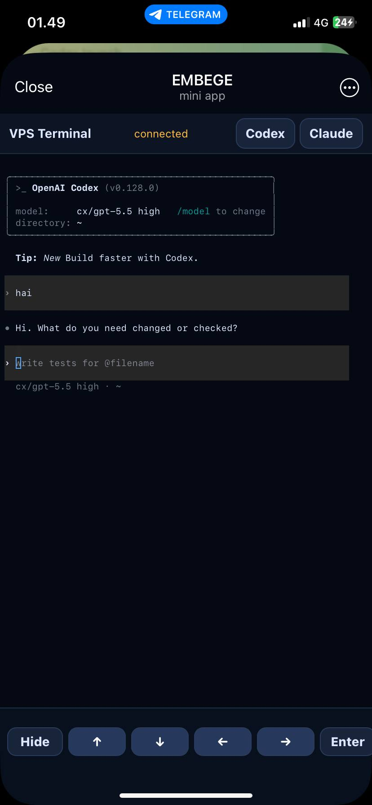
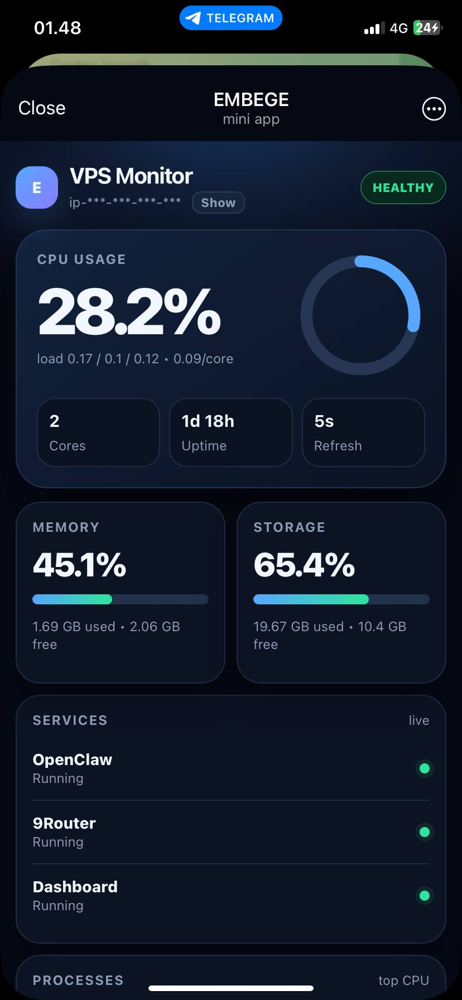

# Telegram VPS Monitor Mini App

**Monitor your VPS, open an emergency terminal, and run Claude Code / Codex directly from Telegram.**

A lightweight internal Telegram Mini App for private server operators. Built for quick checks, urgent fixes, and small AI-assisted tasks from your phone — without opening a full SSH client.

> Best use case: **emergency access + small tasks**. For long/heavy interactive terminal work, SSH/desktop terminal is still the better tool.

<p align="center">
  
  
  
  
</p>

## Why this exists

Sometimes you only have your phone.

You need to:

- check whether the VPS is alive
- inspect CPU/RAM/disk/load
- restart or inspect a service
- run a quick shell command
- ask **Claude Code** to patch something small
- ask **Codex** to review/fix current changes
- handle an urgent production issue before reaching your laptop

This app puts that workflow behind a Telegram Mini App button.

## Highlights

- 📊 **Mobile VPS dashboard** — CPU, load, RAM, disk, uptime, services, processes
- 📱 **Telegram Mini App** — opens from a `VPS` button inside Telegram
- 🧠 **Claude Code from Telegram** — quick coding fixes, reviews, small edits
- 🤖 **Codex from Telegram** — review/change tasks from a mobile terminal
- 🖥️ **Web terminal** — PTY shell powered by xterm.js
- 🔐 **Telegram auth** — validates Telegram `initData` + allowlisted user ID
- ⚡ **Lightweight** — Flask + vanilla JS, no frontend build step
- 🧩 **Simple deployment** — Gunicorn + systemd + HTTPS tunnel/domain

## Intended usage

### Good fit

- Emergency VPS checks
- Quick command execution
- Small code edits with Claude Code/Codex
- Reviewing current git changes
- Restarting services
- Checking logs
- Running short scripts
- Mobile-only “hotfix assist”

### Not ideal

- Long coding sessions
- Full-screen complex TUI workflows
- Heavy copy/paste work
- Anything requiring perfect native terminal ergonomics

Telegram iOS/WebView is convenient, but it is not a full terminal emulator. Treat this as a fast remote-control panel, not a total SSH replacement.

## Stack

- Python Flask
- Flask-Sock WebSocket terminal
- Gunicorn
- Vanilla HTML/CSS/JS
- xterm.js vendored under `static/vendor/`

## Routes

- `/` — monitor dashboard
- `/terminal` — shell terminal
- `/claude` — terminal launching Claude Code CLI
- `/codex` — terminal launching Codex CLI
- `/api/metrics` — JSON metrics

## Quick start

This quick start is for local/dev validation. For a real Telegram Mini App, you still need a public HTTPS tunnel/domain and `setChatMenuButton` setup.

```bash
git clone https://github.com/adryndian/telegram-vps-monitor-miniapp.git
cd telegram-vps-monitor-miniapp

python3 -m venv .venv
. .venv/bin/activate
pip install -r requirements.txt

cp .env.example .env
nano .env
```

Minimum `.env` values:

```env
DASHBOARD_PASSWORD=change-this-to-a-strong-random-password
ALLOWED_TG_USER_ID=your_numeric_telegram_user_id
TELEGRAM_BOT_TOKEN=your_telegram_bot_token
TERMINAL_PASSWORD_FALLBACK=false
```

Run dev server:

```bash
python app.py
```

Open locally:

```text
http://127.0.0.1:8787
```

Production-style run:

```bash
gunicorn -k gthread --threads 8 -b 127.0.0.1:8787 app:app
```

Then finish the Telegram Mini App setup:

1. Expose `127.0.0.1:8787` through HTTPS using Cloudflare Tunnel, ngrok, or a domain reverse proxy.
2. Set the Telegram bot menu button text to `VPS`.
3. Point the menu button URL to your HTTPS tunnel/domain.
4. Open the Mini App from Telegram and verify dashboard + terminal auth.

## Environment

See `.env.example`.

Important fields:

- `DASHBOARD_PASSWORD` — fallback dashboard password
- `ALLOWED_TG_USER_ID` — only this Telegram user can use the Mini App auth
- `TELEGRAM_BOT_TOKEN` — optional; used for Telegram Mini App auth verification
- `TERMINAL_PIN` — optional extra terminal PIN
- `TERMINAL_PASSWORD_FALLBACK=false` — recommended

## Telegram Mini App setup

Your dashboard must be served via public **HTTPS**.

Set the bot menu button:

```bash
curl -X POST "https://api.telegram.org/bot$BOT_TOKEN/setChatMenuButton" \
  -H "Content-Type: application/json" \
  -d '{
    "menu_button": {
      "type": "web_app",
      "text": "VPS",
      "web_app": {"url": "https://your-domain.example"}
    }
  }'
```

For a specific chat:

```bash
curl -X POST "https://api.telegram.org/bot$BOT_TOKEN/setChatMenuButton" \
  -H "Content-Type: application/json" \
  -d '{
    "chat_id": 123456789,
    "menu_button": {
      "type": "web_app",
      "text": "VPS",
      "web_app": {"url": "https://your-domain.example"}
    }
  }'
```

## Tunneling / HTTPS options

Telegram Mini Apps require a public HTTPS URL. Pick one:

### Option A — Cloudflare Quick Tunnel

Fastest test path. No account required, but URL is temporary.

```bash
cloudflared tunnel --url http://127.0.0.1:8787 --no-autoupdate
```

Cloudflare prints a URL like:

```text
https://random-words.trycloudflare.com
```

Use that URL in `setChatMenuButton`.

> Good for testing. Not recommended for permanent use because the URL changes after restart.

### Option B — Cloudflare Named Tunnel recommended

Best for always-on private usage with your own domain/subdomain.

```bash
cloudflared tunnel login
cloudflared tunnel create vps-monitor
cloudflared tunnel route dns vps-monitor vps.example.com
```

Create `~/.cloudflared/config.yml`:

```yaml
tunnel: vps-monitor
credentials-file: /home/ubuntu/.cloudflared/<TUNNEL_ID>.json

ingress:
  - hostname: vps.example.com
    service: http://127.0.0.1:8787
  - service: http_status:404
```

Run:

```bash
cloudflared tunnel run vps-monitor
```

Then set your Telegram Mini App URL to:

```text
https://vps.example.com
```

### Option C — ngrok

Good if you already have ngrok and a static domain.

```bash
ngrok config add-authtoken <NGROK_TOKEN>
ngrok http 8787
```

For stable use:

```bash
ngrok http --domain=your-static-domain.ngrok-free.app 8787
```

### Option D — Caddy/Nginx + domain

If your VPS has a public IP and domain DNS points to it:

```text
https://vps.example.com -> http://127.0.0.1:8787
```

Caddy example:

```caddyfile
vps.example.com {
  reverse_proxy 127.0.0.1:8787
}
```

## systemd user service

Example:

```ini
[Unit]
Description=Telegram VPS Monitor Mini App
After=network.target

[Service]
Type=simple
WorkingDirectory=/path/to/telegram-vps-monitor-miniapp
EnvironmentFile=/path/to/telegram-vps-monitor-miniapp/.env
ExecStart=/path/to/telegram-vps-monitor-miniapp/.venv/bin/gunicorn -k gthread --threads 8 -b 127.0.0.1:8787 app:app
Restart=always
RestartSec=5

[Install]
WantedBy=default.target
```

## Ask an AI agent to install this app

Paste this into OpenClaw, Claude Code, Codex, Cursor, or another coding agent with VPS shell access.

```text
Install and configure Telegram VPS Monitor Mini App on this Linux VPS.

Repository:
https://github.com/adryndian/telegram-vps-monitor-miniapp

Goal:
Create a private Telegram Mini App that lets me monitor the VPS and run emergency/small-task terminal sessions, including Claude Code and Codex, directly from Telegram.

Requirements:
1. Clone repo to /opt/telegram-vps-monitor-miniapp or ~/telegram-vps-monitor-miniapp.
2. Create Python venv and install requirements.txt.
3. Create .env from .env.example.
4. Ask me for:
   - Telegram bot token
   - my Telegram numeric user ID
   - preferred public HTTPS method: Cloudflare Tunnel, ngrok, or domain reverse proxy
5. Set DASHBOARD_PASSWORD to a strong random value.
6. Set ALLOWED_TG_USER_ID to my Telegram user ID.
7. Set TELEGRAM_BOT_TOKEN to my bot token.
8. Keep TERMINAL_PASSWORD_FALLBACK=false.
9. Create a systemd service that runs:
   gunicorn -k gthread --threads 8 -b 127.0.0.1:8787 app:app
10. Start and enable the service.
11. Verify http://127.0.0.1:8787/api/metrics works.
12. Configure HTTPS tunnel/reverse proxy.
13. Use Telegram Bot API setChatMenuButton with text "VPS" and the HTTPS URL.
14. Test the Mini App from Telegram.
15. Do not commit or print secrets. Show only masked credentials.

Security:
- Never expose the app over plain HTTP publicly.
- Never commit .env.
- Terminal routes /terminal, /claude, /codex must only work for the allowlisted Telegram user.
```

## AI agent maintenance prompt

Use this when asking an AI agent to update an existing install:

```text
Update my Telegram VPS Monitor Mini App safely.

Tasks:
1. Go to the app directory.
2. Check git status and show me local changes before overwriting anything.
3. Pull latest changes from main.
4. Preserve .env.
5. Reinstall requirements if changed.
6. Restart the dashboard service.
7. Verify /api/metrics, /, /terminal, /claude, and /codex routes.
8. Confirm Telegram Mini App URL still works.
9. Do not reveal bot token, dashboard password, or tunnel credentials.
```

## Security checklist

- Do not commit `.env`
- Do not expose without HTTPS
- Set `ALLOWED_TG_USER_ID`
- Prefer `TERMINAL_PASSWORD_FALLBACK=false`
- Use a private access layer when possible
- Rotate tunnel URLs/passwords if leaked
- Do not share screenshots containing public tunnel URLs
- Remember: terminal access is VPS shell access

## License

MIT
