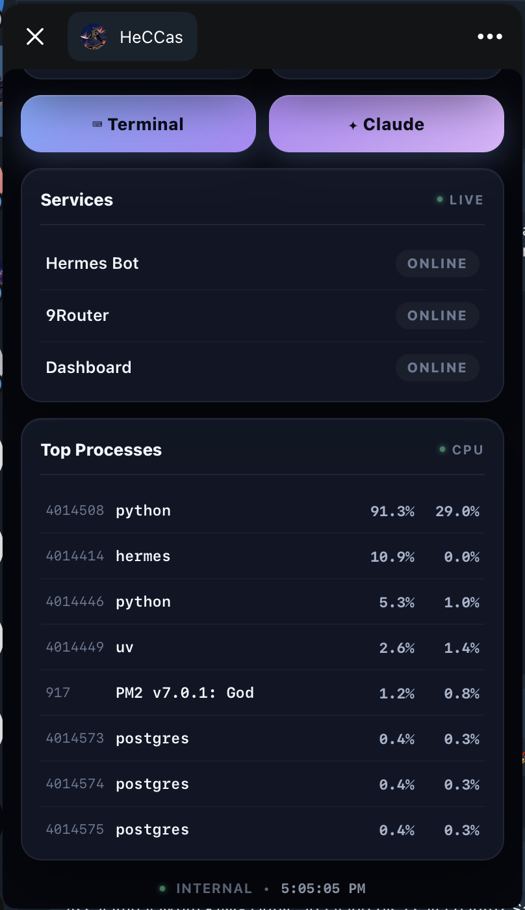
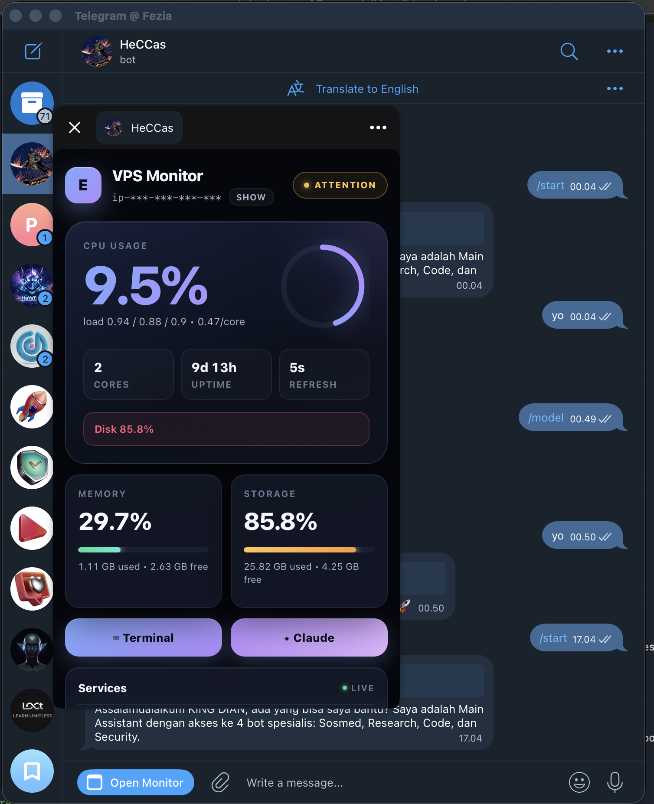

# Telegram VPS Monitor Mini App

**Monitor your VPS, open an emergency terminal, and run Claude Code / Codex — straight from Telegram.**

A lightweight, self-hosted Telegram Mini App for private server operators. Glassmorphism UI, mobile-first, Flask + vanilla JS — no build step, no framework lock-in.

> Best use case: **emergency access + small tasks**. For long/heavy interactive terminal work, SSH/desktop terminal is still the better tool.

<p align="center">
   
  
  
  
</p>

---

## What's new (v2026-05)

- 🎨 **Redesigned UI** — aurora gradient background, glassmorphism panels, gradient text on metrics, animated pulse status, shimmer skeleton loading
- 🔐 **Fixed terminal auth** — terminal CTAs on home page now correctly forward Telegram `initData` via `?tg=` query param
- ⚡ **Terminal CTAs on dashboard** — open Terminal or Claude Code without leaving the home view
- 📱 **Better mobile typography** — tabular-nums, tuned letter-spacing, breakpoint at 380px
- 🔍 **Visible health indicators** — animated pulse dot on status badges, shimmer skeleton until first metrics arrive

---

## Why this exists

Sometimes you only have your phone. You need to:

- check whether the VPS is alive
- inspect CPU/RAM/disk/load
- restart or inspect a service
- run a quick shell command
- ask **Claude Code** to patch something
- ask **Codex** to review/fix current changes
- handle an urgent production issue before reaching your laptop

This app puts that whole workflow behind a single Telegram Mini App button.

---

## Highlights

- 📊 **Mobile dashboard** — CPU (with ring + gradient text), RAM, disk, load, uptime, services, top processes
- 📱 **Telegram Mini App** — opens from a `VPS` button inside Telegram
- 🧠 **Claude Code from Telegram** — quick coding fixes, reviews, small edits
- 🤖 **Codex from Telegram** — review/change tasks from a mobile terminal
- 🖥️ **Web terminal** — PTY shell powered by xterm.js, mobile keyboard helpers
- 🔐 **Telegram auth** — verifies `initData` HMAC + allowlists user ID
- ⚡ **Lightweight** — Flask + vanilla JS, zero build step
- 🧩 **Simple deployment** — gunicorn + systemd + HTTPS tunnel/domain

---

## Stack

- Python 3.10+ Flask
- Flask-Sock (WebSocket terminal)
- Gunicorn (production)
- Vanilla HTML/CSS/JS, xterm.js (vendored under `static/vendor/`)
- glassmorphism CSS + SVG gradients

---

## Routes

| Route | Description |
|---|---|
| `/` | Glassmorphism dashboard (CPU/RAM/disk/services/processes) |
| `/terminal` | PTY shell terminal (xterm.js) |
| `/claude` | Terminal that auto-launches `claude` CLI |
| `/codex` | Terminal that auto-launches `codex` CLI |
| `/api/metrics` | JSON metrics endpoint |
| `/ws/terminal` | WebSocket for terminal I/O |

---

## Easy install (one-command)

For Ubuntu/Debian VPS. Run as the user that will own the service (typically `ubuntu` or your shell user — **not** root).

```bash
curl -fsSL https://raw.githubusercontent.com/adryndian/telegram-vps-monitor-terminal-ai-miniapp/main/scripts/install.sh | bash
```

> If the install script doesn't exist yet (this repo is still bootstrapping), use the **Manual install** below.

The script will:

1. Clone repo to `~/telegram-vps-monitor-terminal-ai-miniapp/`
2. Create Python venv + install deps
3. Copy `.env.example` → `.env` and prompt for required values
4. Generate a strong random `DASHBOARD_PASSWORD`
5. Create systemd service `telegram-vps-monitor.service`
6. Start + enable the service
7. Print next-step instructions for HTTPS tunnel + Telegram menu button

---

## Manual install

### 1. Clone & set up

```bash
git clone https://github.com/adryndian/telegram-vps-monitor-terminal-ai-miniapp.git
cd telegram-vps-monitor-terminal-ai-miniapp

python3 -m venv .venv
. .venv/bin/activate
pip install -r requirements.txt
```

### 2. Configure

```bash
cp .env.example .env
nano .env
```

Minimum required:

```env
DASHBOARD_PASSWORD=<generate-strong-random>
ALLOWED_TG_USER_ID=<your-numeric-telegram-user-id>
TELEGRAM_BOT_TOKEN=<bot-father-token>
TERMINAL_PASSWORD_FALLBACK=true
HOST=127.0.0.1
PORT=8787
REFRESH_SECONDS=5
```

To get your Telegram numeric user ID, message `@userinfobot` on Telegram.

### 3. Run

**Dev:**

```bash
python app.py
```

**Production:**

```bash
gunicorn -k gthread --threads 8 -b 127.0.0.1:8787 app:app
```

Test locally: `http://127.0.0.1:8787` (use `DASHBOARD_PASSWORD` for basic auth).

### 4. Expose via HTTPS

Telegram Mini Apps **require** public HTTPS. Pick one tunneling option below.

### 5. Set the Telegram menu button

```bash
BOT_TOKEN=<your-token>
URL=https://your-domain.example

curl -X POST "https://api.telegram.org/bot$BOT_TOKEN/setChatMenuButton" \
  -H "Content-Type: application/json" \
  -d "{
    \"menu_button\": {
      \"type\": \"web_app\",
      \"text\": \"VPS\",
      \"web_app\": {\"url\": \"$URL\"}
    }
  }"
```

Open Telegram → your bot → tap the `VPS` menu button → dashboard loads.

---

## HTTPS tunneling options

### Option A — Cloudflare Quick Tunnel (fastest test)

```bash
cloudflared tunnel --url http://127.0.0.1:8787 --no-autoupdate
```

Cloudflare prints a temporary `https://*.trycloudflare.com` URL. Good for testing, **not for production** (URL changes on restart).

### Option B — Cloudflare Named Tunnel ⭐ recommended

Always-on with your own domain.

```bash
cloudflared tunnel login
cloudflared tunnel create vps-monitor
cloudflared tunnel route dns vps-monitor vps.example.com
```

Create `~/.cloudflared/config.yml`:

```yaml
tunnel: vps-monitor
credentials-file: /home/ubuntu/.cloudflared/<TUNNEL_ID>.json

ingress:
  - hostname: vps.example.com
    service: http://127.0.0.1:8787
  - service: http_status:404
```

Run:

```bash
cloudflared tunnel run vps-monitor
```

For auto-start: `sudo cloudflared service install`.

### Option C — ngrok

```bash
ngrok config add-authtoken <NGROK_TOKEN>
ngrok http --domain=your-static-domain.ngrok-free.app 8787
```

### Option D — Caddy / Nginx + domain

```caddyfile
vps.example.com {
  reverse_proxy 127.0.0.1:8787
}
```

---

## systemd service

`/etc/systemd/system/telegram-vps-monitor.service`:

```ini
[Unit]
Description=Telegram VPS Monitor Mini App
After=network.target

[Service]
Type=simple
User=ubuntu
WorkingDirectory=/home/ubuntu/telegram-vps-monitor-terminal-ai-miniapp
EnvironmentFile=/home/ubuntu/telegram-vps-monitor-terminal-ai-miniapp/.env
ExecStart=/home/ubuntu/telegram-vps-monitor-terminal-ai-miniapp/.venv/bin/gunicorn -k gthread --threads 8 -b 127.0.0.1:8787 app:app
Restart=always
RestartSec=5
KillMode=mixed

[Install]
WantedBy=multi-user.target
```

Enable + start:

```bash
sudo systemctl daemon-reload
sudo systemctl enable telegram-vps-monitor
sudo systemctl start telegram-vps-monitor
sudo systemctl status telegram-vps-monitor
```

---

## Environment reference

| Variable | Required | Description |
|---|---|---|
| `DASHBOARD_PASSWORD` | ✅ | Fallback dashboard password (basic auth) |
| `ALLOWED_TG_USER_ID` | ✅ | Numeric Telegram user ID — only this user passes Mini App auth |
| `TELEGRAM_BOT_TOKEN` | ✅ | Bot token from @BotFather (used to verify `initData` HMAC) |
| `TERMINAL_PIN` | optional | Extra PIN required to open `/terminal` |
| `TERMINAL_PASSWORD_FALLBACK` | optional | `true` allows password-based terminal auth as fallback |
| `HOST` | optional | Default `127.0.0.1` |
| `PORT` | optional | Default `8787` |
| `REFRESH_SECONDS` | optional | Dashboard auto-refresh interval, default `5` |
| `ALERT_RAM_PCT` | optional | RAM alert threshold % |
| `ALERT_DISK_PCT` | optional | Disk alert threshold % |
| `ALERT_LOAD_PER_CORE` | optional | Load average per-core alert threshold |
| `TELEGRAM_CHAT_ID` | optional | For optional bot-driven alert delivery |

See `.env.example` for the full list.

---

## Update existing install

```bash
cd ~/telegram-vps-monitor-terminal-ai-miniapp
git pull origin main
. .venv/bin/activate
pip install -r requirements.txt
sudo systemctl restart telegram-vps-monitor
```

Verify:

```bash
curl -s -o /dev/null -w 'HTTP:%{http_code}\n' http://127.0.0.1:8787/
sudo systemctl status telegram-vps-monitor --no-pager
```

---

## Ask an AI agent to install this app

Paste this into Claude Code, Codex, OpenClaw, Cursor, or another coding agent with VPS shell access.

````text
Install and configure Telegram VPS Monitor Mini App on this Linux VPS.

Repository:
https://github.com/adryndian/telegram-vps-monitor-terminal-ai-miniapp

Goal:
Create a private Telegram Mini App that lets me monitor the VPS and run
emergency/small-task terminal sessions, including Claude Code and Codex,
directly from Telegram.

Requirements:
1. Clone repo to ~/telegram-vps-monitor-terminal-ai-miniapp.
2. Create Python venv and install requirements.txt.
3. Create .env from .env.example.
4. Ask me for:
   - Telegram bot token
   - my Telegram numeric user ID
   - preferred public HTTPS method (Cloudflare Tunnel / ngrok / domain reverse proxy)
5. Generate a strong random DASHBOARD_PASSWORD.
6. Set ALLOWED_TG_USER_ID and TELEGRAM_BOT_TOKEN to the values I provided.
7. Set TERMINAL_PASSWORD_FALLBACK=true.
8. Create systemd service `telegram-vps-monitor.service` running:
   gunicorn -k gthread --threads 8 -b 127.0.0.1:8787 app:app
9. Enable + start the service.
10. Verify http://127.0.0.1:8787/api/metrics returns 200 with JSON.
11. Set up HTTPS tunnel/reverse proxy (Cloudflare named tunnel preferred).
12. Call Telegram Bot API setChatMenuButton with text "VPS" and the HTTPS URL.
13. Test by opening the Mini App from Telegram on my phone.
14. Do not commit or print secrets. Show only masked credentials.

Security:
- Never expose the app over plain HTTP publicly.
- Never commit .env.
- Terminal routes (/terminal, /claude, /codex) must only work for the
  allowlisted Telegram user (ALLOWED_TG_USER_ID).
````

### Maintenance prompt

````text
Update my Telegram VPS Monitor Mini App safely.

Tasks:
1. cd to ~/telegram-vps-monitor-terminal-ai-miniapp.
2. git status and show me local changes before overwriting anything.
3. git pull origin main.
4. Preserve .env.
5. Reinstall requirements if changed.
6. Restart the systemd service.
7. Verify /api/metrics, /, /terminal, /claude, /codex routes return expected status.
8. Confirm Telegram Mini App URL still works (curl -I against the public URL).
9. Do not reveal bot token, dashboard password, or tunnel credentials.
````

---

## Architecture overview

```
┌─────────────────┐
│ Telegram client │  ← Mini App opened from VPS menu button
└────────┬────────┘
         │ HTTPS (Cloudflare Tunnel / domain)
         ▼
┌─────────────────┐
│ Flask app:8787  │  ← gunicorn + systemd
│  ├── /          │  ← glassmorphism dashboard (templates/index.html)
│  ├── /terminal  │  ← xterm.js terminal page
│  ├── /api/metrics
│  └── /ws/terminal (WebSocket → PTY)
└────────┬────────┘
         │
         ▼
   /proc, ps, systemctl, df, free, uptime
```

**Auth flow:**

1. Telegram client opens Mini App → `Telegram.WebApp.initData` available
2. Frontend attaches `initData` as `X-Telegram-Init-Data` header (dashboard) or `?tg=` query param (terminal links)
3. Backend `auth_ok()` verifies HMAC with `TELEGRAM_BOT_TOKEN` + checks user ID matches `ALLOWED_TG_USER_ID`
4. Falls back to `DASHBOARD_PASSWORD` basic auth for non-Telegram clients

---

## Troubleshooting

### Dashboard shows AUTH FAILED

- Confirm `TELEGRAM_BOT_TOKEN` matches the bot whose menu button points here
- Confirm `ALLOWED_TG_USER_ID` is **your** numeric ID (not the bot's)
- Open from Telegram, not directly from a browser

### Terminal opens but shows `Unauthorized`

- This was a bug pre-v2026-05 — pull latest `main` and restart
- Verify `app.py` line 58 includes `or request.args.get('tg','')` in `auth_ok()`

### Mini App won't load on Telegram

- Telegram requires **HTTPS**; HTTP URLs silently fail
- Check tunnel is up: `curl -I https://your-domain.example`
- Verify menu button: `curl https://api.telegram.org/bot$BOT_TOKEN/getChatMenuButton`

### Service won't start

```bash
sudo journalctl -u telegram-vps-monitor -n 50 --no-pager
```

Common causes: `.env` not loaded → check `EnvironmentFile=` path; venv path wrong; port already in use.

### Terminal says `disconnected` immediately

- Cloudflare tunnel may strip WebSocket upgrade — verify ingress config doesn't block `/ws/terminal`
- For `cloudflared`, WebSockets work by default; for nginx, add `proxy_http_version 1.1` + `Upgrade` headers

---

## Security checklist

- [ ] `.env` is gitignored (never commit credentials)
- [ ] App is **only** exposed via HTTPS
- [ ] `ALLOWED_TG_USER_ID` is set to your numeric Telegram ID
- [ ] `DASHBOARD_PASSWORD` is a strong random string (≥ 24 chars)
- [ ] `TERMINAL_PASSWORD_FALLBACK` enabled only if you understand the trade-off
- [ ] Tunnel credentials (Cloudflare/ngrok) are stored outside the repo
- [ ] Don't share screenshots that include public tunnel URLs
- [ ] **Remember:** terminal access = full VPS shell access. Treat the auth setup as critical.

---

## Contributing

PRs welcome for:

- Additional metrics (network I/O, GPU stats, Docker container summaries)
- More tunnel provider docs (Tailscale, FRP, Bore)
- Mobile keyboard improvements for the terminal
- Translation/i18n

Keep the spirit: **lightweight, no build step, no framework lock-in**.

---

## License

MIT — see `LICENSE`.

Built for solo developers and small teams who need a quick mobile lifeline to their VPS.
